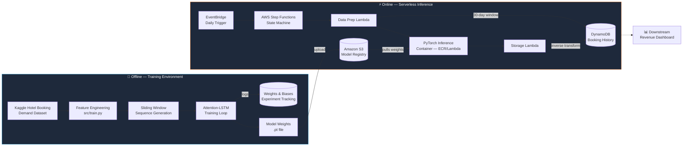
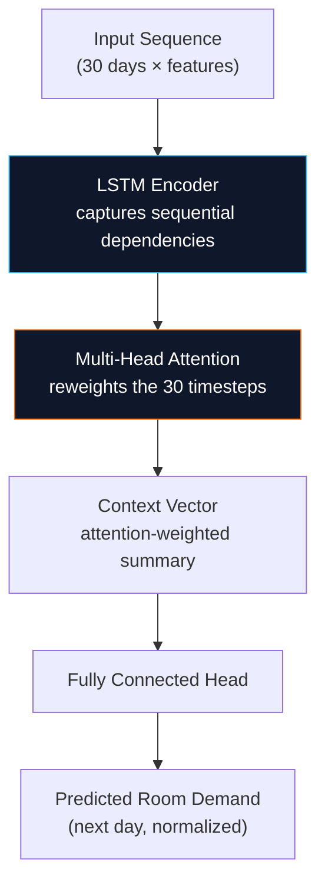
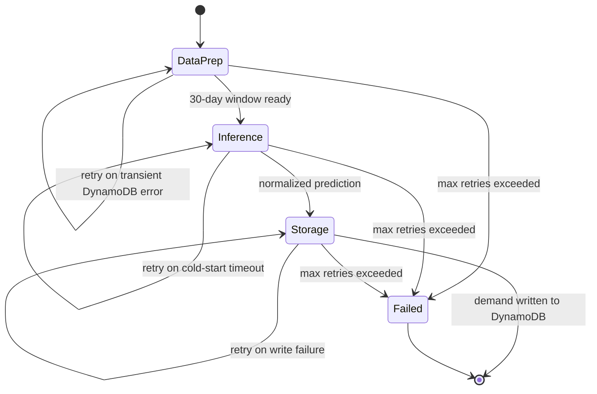

# 🏨 Hotel Booking Demand Forecasting — End-to-End MLOps Pipeline

[](https://www.python.org/)
[](https://pytorch.org/)
[](https://aws.amazon.com/)
[](https://wandb.ai/)
[](#)

An end-to-end machine learning platform that predicts **daily hotel room demand**. A custom PyTorch **Attention-LSTM** network captures complex temporal seasonality in booking data, and the trained model is served through a fault-tolerant, serverless **AWS** pipeline orchestrated by Step Functions.

> **Author:** Tanmay Hadke | AI Software Developer

---

## 📋 Table of Contents

- [Business Value](#-business-value)
- [System Architecture](#-system-architecture)
- [Deep Learning Core](#-deep-learning-core)
  - [Why Not a Vanilla LSTM?](#why-not-a-vanilla-lstm)
  - [Time-Series Feature Engineering](#time-series-feature-engineering)
  - [Sliding Window Generation](#sliding-window-generation)
  - [Attention Mechanism](#attention-mechanism)
  - [Huber Loss Optimization](#huber-loss-optimization)
  - [Experiment Tracking](#experiment-tracking)
- [Cloud Infrastructure (AWS)](#️-cloud-infrastructure-aws)
  - [State Machine Orchestration](#state-machine-orchestration)
  - [Microservices Decoupling](#microservices-decoupling)
  - [Containerization](#containerization)
  - [NoSQL Database Management](#nosql-database-management)
  - [Principle of Least Privilege (IAM)](#principle-of-least-privilege-iam)
- [Local Execution & Training](#-local-execution--training)
- [Tech Stack](#️-tech-stack)

---

## 🎯 Business Value

Accurate demand forecasting is the backbone of dynamic pricing and revenue management in hospitality. By predicting occupancy spikes and dips **7 to 30 days in advance**, a hotel's revenue team can:

| Capability | Impact |
|---|---|
| **Automated Yield Management** | Adjust room rates ahead of demand surges instead of reacting to them |
| **OTA Distribution Optimization** | Allocate inventory across channels (Booking.com, Expedia, direct) based on forecasted pickup |
| **RevPAR Maximization** | Convert forecast confidence into pricing confidence, protecting revenue per available room |
| **Staffing & Ops Planning** | Anticipate housekeeping and front-desk load days in advance |

---

## 🏗 System Architecture

The platform is split into two decoupled lifecycles: an **offline training loop** (local/experiment environment) and an **online inference loop** (serverless, event-driven on AWS). The training loop produces a versioned model artifact; the inference loop consumes it.



The two loops only ever communicate through **S3 (model artifact)** and **DynamoDB (data)** — neither service calls the other directly, which is what allows the model to be retrained and redeployed without touching the inference pipeline.

---

## 🧠 Deep Learning Core

### Why Not a Vanilla LSTM?

Traditional time-series models like ARIMA struggle with the volatility of hospitality data — a single local event (a concert, a conference) can spike demand by hundreds of rooms in a way that breaks stationarity assumptions. A standard LSTM trained on this data tends toward **mean collapse**: since the loss function rewards minimizing average error, the network learns to hedge its bets and predict something close to the historical mean rather than committing to sharp peaks and troughs.

This project's architecture (`src/model.py`) addresses both problems directly:



### Time-Series Feature Engineering

Raw booking counts alone don't tell the network *why* demand moves. Before the sequences ever reach the LSTM, the data prep stage engineers **multivariate temporal inputs**:

- **Day-of-Week** (scaled/cyclically encoded) — teaches the network the weekday-vs-weekend booking rhythm without treating Sunday and Monday as numerically distant.
- **Month** (scaled/cyclically encoded) — captures seasonal demand curves (summer travel peaks, holiday troughs).
- These engineered features are **concatenated** with the historical demand values at every timestep, so the LSTM ingests "what happened" and "when it happened" together rather than inferring seasonality implicitly from a raw scalar series.

### Sliding Window Generation

The model doesn't see the entire booking history at once — it's trained on fixed-length **sliding windows** cut from the continuous time series. A window of the last **30 days** of (demand + engineered features) is used to predict the value on **day 31**; the window then slides forward by one day and repeats across the whole dataset.

```
Day:      1   2   3  ...  29  30 | 31
Window 1: ├────────── 30 days ───┤ → predict day 31
Window 2:     ├────────── 30 days ───┤ → predict day 32
Window 3:         ├────────── 30 days ───┤ → predict day 33
                    ...slides forward one day at a time...
```

This is what turns a single flat CSV into thousands of overlapping supervised training examples, and it's exactly mirrored at inference time: the **Data Prep Lambda** queries the *same* 30-day trailing window from DynamoDB before every prediction, so the input shape the model sees in production is identical to what it saw in training.

### Attention Mechanism

On top of the LSTM's hidden states, a custom **Multi-Head Attention** layer learns to dynamically weight specific past days rather than treating the final LSTM hidden state as a bottleneck summary of the whole window. In practice this lets the network, for example, assign disproportionate weight to *last Tuesday* when forecasting *next Tuesday* — capturing weekly periodicity directly rather than hoping the LSTM's recurrence preserves it 7 steps back. This is the key mechanism that lets the model reproduce sharp, day-specific demand patterns instead of collapsing toward a smoothed average.

### Huber Loss Optimization

Standard **MSE** squares the error, which means a single outlier day (say, a local event causing a 300-room spike) generates a gradient large enough to dominate an entire training batch — pushing the model to under-react to genuine peaks in order to avoid that penalty. **Huber Loss** behaves like MSE for small errors (precise fitting on typical days) but transitions to a linear penalty for large errors (outlier days), so the model isn't punished disproportionately for trying to predict amplitude peaks. The net effect is a model that's willing to commit to a spike prediction instead of hedging toward the mean.

### Experiment Tracking

Every training run is versioned through **Weights & Biases (W&B)** — hyperparameters (window size, hidden dimensions, attention heads, learning rate, Huber delta) and per-epoch loss curves are logged automatically via `wandb login` + `python -m src.train`. This gives a reproducible audit trail: any deployed `.pt` file in S3 can be traced back to the exact run, config, and loss curve that produced it, which matters when comparing candidate models before promoting one to production.

---

## ☁️ Cloud Infrastructure (AWS)

The inference side is deployed **serverlessly**, specifically engineered to work around AWS Lambda's deployment package size limits for large PyTorch binaries by shipping the inference function as a **container image** rather than a zipped function.

### State Machine Orchestration

**AWS Step Functions** acts as the orchestrator. Rather than one monolithic Lambda doing data-fetch → inference → write-back in a single invocation (where any failure means re-running everything, including the expensive tensor forward-pass), the workflow is broken into independently retryable states.



If, say, the Storage Lambda fails to write to DynamoDB, Step Functions retries **only that state** — the model inference that already ran successfully is never redone. This is the difference between a few cents of retry cost and re-running a GPU/CPU tensor pass unnecessarily.

### Microservices Decoupling

Each stage of the pipeline is a **single-responsibility Lambda function**, deployed and versioned independently:

| Service | Responsibility | Does *not* know about |
|---|---|---|
| **Data Prep Lambda** | Query 30-day window from DynamoDB, normalize, extract temporal features | The model architecture or S3 |
| **PyTorch Inference Container** | Pull `.pt` weights from S3, run forward-pass, output normalized prediction | Where the data came from or where it's going |
| **Storage Lambda** | Apply inverse transform, persist final prediction to DynamoDB | How the prediction was computed |

Because these services only communicate through the payload Step Functions passes between states, any one of them can be redeployed, rolled back, or scaled independently — updating the model container doesn't require touching the Data Prep or Storage Lambdas at all.

### Containerization

The inference Lambda is packaged as a **CPU-optimized Docker image** pushed to **Amazon ECR**, rather than a standard zipped Lambda deployment. PyTorch's compiled binaries and CUDA/CPU kernels routinely exceed Lambda's 250MB unzipped package limit for `.zip` deployments; container-image Lambdas support up to 10GB, which is what makes shipping a full PyTorch runtime inside a managed, serverless function possible at all.

### NoSQL Database Management

**DynamoDB** stores both the raw historical booking data the model reads from and the predictions it writes back to. A key-value / document store fits this workload well because:
- Access patterns are simple and predictable — "get the last 30 days for this hotel," "write today's forecast" — which plays to DynamoDB's strength in single-digit-millisecond lookups on a known partition key rather than complex joins.
- Throughput scales automatically with the size of the property portfolio without manual schema migrations.
- The same table structure serves both the write path (Storage Lambda) and the read path (downstream dashboards) without an intermediate ETL step.

### Principle of Least Privilege (IAM)

Each Lambda in the state machine is issued its **own IAM execution role**, scoped to exactly the actions and resources it needs — nothing more:

| Lambda | Permitted Actions | Explicitly Denied |
|---|---|---|
| **Data Prep** | `dynamodb:Query` on the bookings table | Write access to DynamoDB, any S3 access |
| **PyTorch Inference** | `s3:GetObject` on the model-weights prefix only | `s3:PutObject`/`s3:DeleteObject`, DynamoDB access |
| **Storage** | `dynamodb:PutItem` on the predictions table | Read access to raw booking history, S3 access |

This means a compromised or misconfigured Inference container can pull model weights but can neither read nor write a single row of booking data — and a bug in the Storage Lambda can't accidentally overwrite the historical dataset it depends on. Blast radius is contained to exactly the resource each function was built to touch.

---

## 🚀 Local Execution & Training

### 1. Environment Setup

```bash
python3 -m venv venv
source venv/bin/activate
pip install -r requirements.txt
```

### 2. Data Staging

Download the **"Hotel Booking Demand"** dataset from Kaggle and place it in the local (git-ignored) data directory:

```bash
mkdir -p data/raw data/processed models
# Place dataset at: data/raw/hotel_bookings.csv
```

### 3. Training the Model

Authenticate your Weights & Biases account, then run the training module:

```bash
wandb login
python -m src.train
```

### 4. Evaluation

Generate the side-by-side actual vs. forecasted demand visualization:

```bash
python -m src.evaluate
```

---

## 🛠️ Tech Stack

- **Machine Learning:** PyTorch, Pandas, NumPy
- **MLOps:** Weights & Biases (W&B)
- **AWS Serverless:** Lambda, Step Functions, DynamoDB, S3, ECR (Docker)

---

**Author:** Tanmay Hadke | AI Software Developer